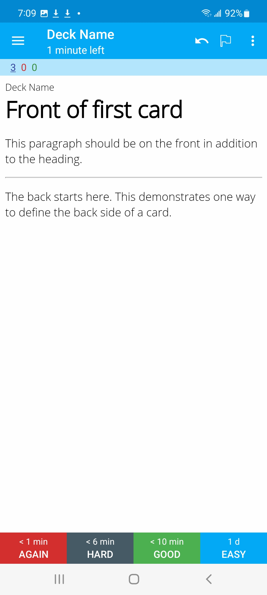
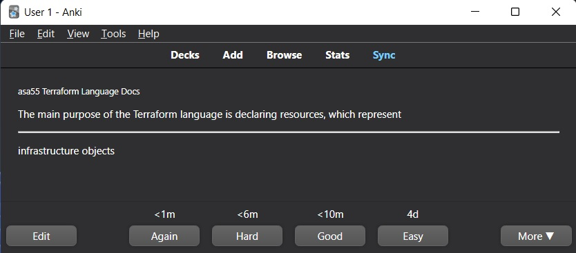

## See what `*-docs-as-flashcards` does, actually 👀

`*-docs-as-flashcards` projects create `.apkg` flashcard decks you can import into Anki.

### Mobile flashcard view in Anki

### Desktop flashcard view in Anki

### See more examples

To see more, specifically how the tagging feature looks in Anki, I recommend checking out [this readme from the `md2apkg-run` project](https://github.com/asa55/md2apkg-run-demo) (on which all `*-docs-as-flashcards` projects depend).

Also, once you start using Anki and importing these flashcard decks, it's all pretty self-explanitory. The above examples are just to quickly give you a rough idea of what to expect.
