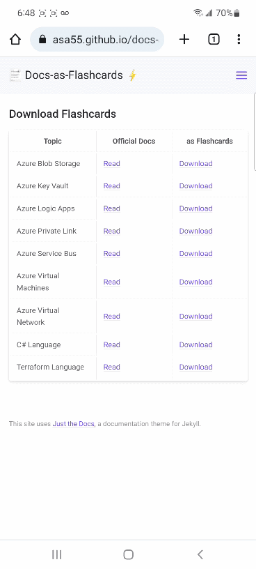
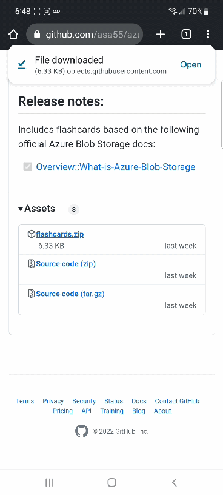
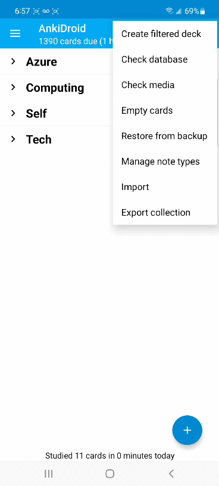
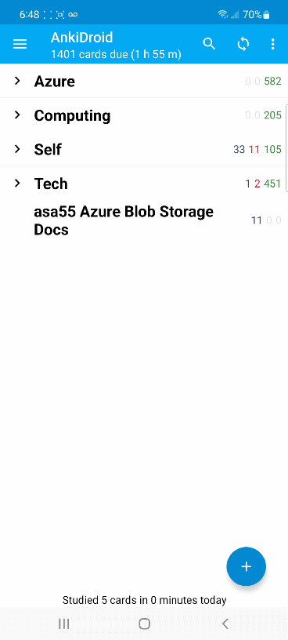
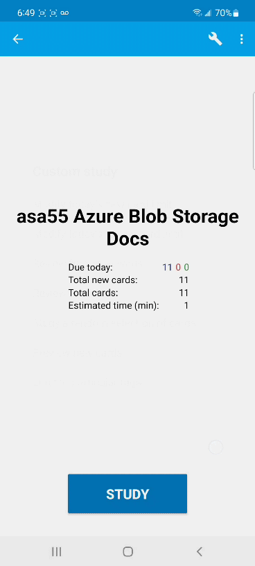

# See what `*-docs-as-flashcards` does, actually 👀

`*-docs-as-flashcards` projects create `.apkg` flashcard decks you can import into Anki. After you have Anki installed, here's how to download and use `*-docs-as-flashcards` flashcards (demo is on the mobile app, but the concepts are the same for the desktop version):

 

## Step 1: From [Downloads](./downloads), select Download, scroll down to get `flashcards.zip`

  

## Step 2: Extract `Deck.apkg` from `flashcards.zip`

  

## Step 3: From Anki, import `Deck.apkg`

  

## Step 4: Optionally, limit your study session to specific tags (NOTE: flashcard tags are based on, and always align with, the navigation bar from the official docs)

  

## Step 5: Start your study session 🎉

